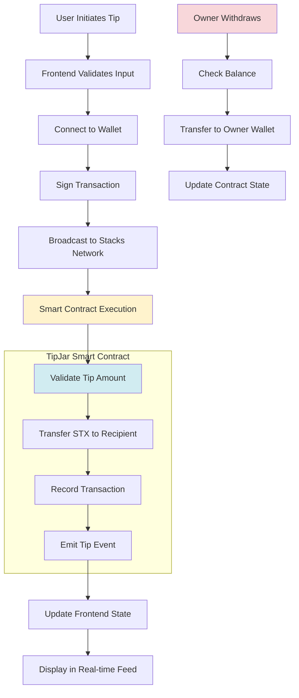

# Stacks TipJar

[](LICENSE)
[](https://reactjs.org/)
[](https://www.typescriptlang.org/)
[](https://vitejs.dev/)

A decentralized tipping application built on the Stacks blockchain, enabling users to send and receive micro-payments in STX tokens through an intuitive web interface.

## Table of Contents

- [Features](#features)
- [Architecture](#architecture)
- [Contract System Design](#contract-system-design)
- [Quick Start](#quick-start)
- [Usage](#usage)
- [Development](#development)
- [Contributing](#contributing)
- [License](#license)
- [Links](#links)

## Features

- Decentralized Tipping: Send tips directly on the blockchain without intermediaries
- Wallet Integration: Seamless connection with Stacks-compatible wallets (Hiro, Xverse, etc.)
- Real-time Feed: Live updates of tips and transactions
- Responsive Design: Optimized for desktop and mobile devices
- Owner Dashboard: Track earnings and manage your tip jar
- Secure Transactions: Built-in security with Stacks' smart contract capabilities

## Architecture


### Component Architecture

The application follows a modular component architecture:

- Pages: Route-based page components (Index, NotFound)
- Components: Reusable UI components (forms, cards, buttons)
- Hooks: Custom React hooks for state and side effects
- Lib: Utility functions and blockchain interactions
- UI: Shadcn/ui component library integration

## Contract System Design



### Smart Contract Overview

The TipJar smart contract is written in Clarity and deployed on the Stacks blockchain:

- **Contract Address**: STGDS0Y17973EN5TCHNHGJJ9B31XWQ5YXBQ0KQ2Y
- **Contract Name**: tip-jar
- **Tip Function**: Allows users to send STX tips to a specified recipient
- **Owner Management**: Contract owner can withdraw accumulated tips
- **Event Logging**: Records all tip transactions for transparency
- **Security**: Built-in validation and access controls

## Quick Start

### Prerequisites

- Node.js 18+ and npm
- A Stacks-compatible wallet (Hiro Wallet recommended)

### Installation

1. Clone the repository
   ```bash
   git clone <repository-url>
   cd stacks-tipjar
   ```

2. Install dependencies
   ```bash
   npm install
   ```

3. Start development server
   ```bash
   npm run dev
   ```

4. Open your browser
   Navigate to `http://localhost:8080`

### Build for Production

```bash
npm run build
```

### Preview Production Build

```bash
npm run preview
```

## Usage

### For Tippers

1. Connect Wallet: Click the "Connect Wallet" button and select your Stacks wallet
2. Enter Tip Details: Fill in the recipient's address and tip amount
3. Send Tip: Confirm the transaction in your wallet
4. View Confirmation: See your tip appear in the live feed

### For Recipients

1. Set Up Your Tip Jar: Connect your wallet to start receiving tips
2. Share Your Address: Share your Stacks address with supporters
3. Monitor Earnings: Use the owner panel to track received tips
4. Withdraw Funds: Transfer STX to your main wallet as needed

## Development

### Project Structure

```
src/
├── components/          # Reusable UI components
│   ├── ui/             # Shadcn/ui components
│   └── ...             # Custom components
├── hooks/              # Custom React hooks
├── lib/                # Utilities and blockchain logic
├── pages/              # Route components
└── main.tsx            # Application entry point
```

### Key Technologies

- Frontend Framework: React 19.2.3 with TypeScript
- Build Tool: Vite for fast development and optimized builds
- Styling: Tailwind CSS with custom design system
- UI Components: Shadcn/ui for consistent, accessible components
- State Management: TanStack Query for server state
- Blockchain: Stacks.js for wallet and transaction handling

### Development Scripts

- `npm run dev` - Start development server
- `npm run build` - Build for production
- `npm run build:dev` - Build in development mode
- `npm run lint` - Run ESLint
- `npm run preview` - Preview production build

### Environment Setup

The application uses the Stacks mainnet by default. For development:

1. Ensure your wallet is connected to the appropriate network
2. Test transactions use testnet STX (no real value)
3. Smart contracts are deployed on the configured network

## Contributing

We welcome contributions from the community! Here's how you can help:

### Development Workflow

1. Fork the repository
2. Create a feature branch
   ```bash
   git checkout -b feature/your-feature-name
   ```
3. Make your changes
4. Run tests and linting
   ```bash
   npm run lint
   ```
5. Commit your changes
   ```bash
   git commit -m "Add your feature description"
   ```
6. Push to your fork
   ```bash
   git push origin feature/your-feature-name
   ```
7. Create a Pull Request

### Guidelines

- Follow the existing code style and conventions
- Write clear, concise commit messages
- Update documentation for any new features
- Ensure all tests pass before submitting
- Respect the MIT license terms

### Areas for Contribution

- UI/UX improvements
- Additional wallet integrations
- Smart contract enhancements
- Documentation improvements
- Performance optimizations
- Accessibility enhancements

## License

This project is licensed under the MIT License - see the [LICENSE](LICENSE) file for details.

## Links

- [Stacks Blockchain](https://stacks.co/)
- [Hiro Wallet](https://www.hiro.so/wallet)
- [Stacks.js Documentation](https://docs.stacks.co/)
- [Shadcn/ui](https://ui.shadcn.com/)

For questions, issues, or contributions:

- Open an issue on GitHub
- Join the Stacks Discord community
- Check the documentation for common solutions
